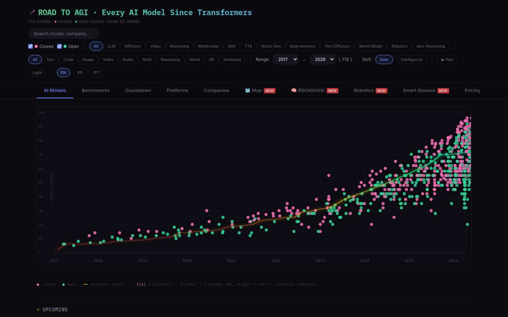
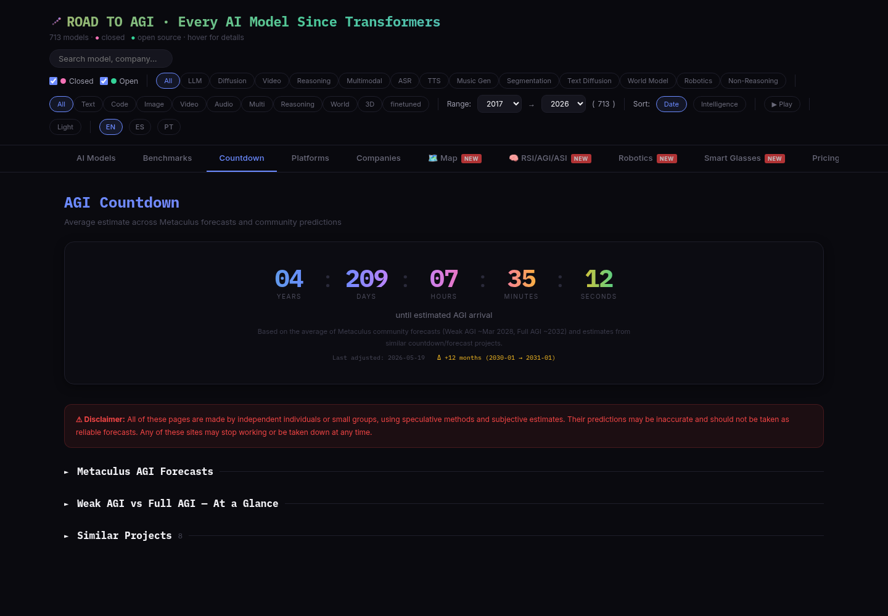

# Road to AGI - Every AI Model Since Transformers

Interactive timeline tracking **700+ AI models** from the original Transformer (2017) to the current frontier (2026).

**Live:** [countdowntoai.com](https://countdowntoai.com/)

## Preview

*Interactive scatter chart: 700+ models by date vs intelligence rating, with a weighted trend line, filters, search, and animated timeline playback.*

*AGI Countdown tab: a live timer based on the average of Metaculus community forecasts and similar countdown/forecast projects.*

## Features

- **Interactive scatter chart** — models plotted by date vs intelligence rating, with weighted trend line
- **Drag-to-zoom** — select any region of the chart to zoom in, double-click to reset
- **Filters** — by type (LLM, Diffusion, Reasoning, Multimodal, ASR, Text Diffusion), category (text, code, image, video, audio, multi), open/closed source, and year range
- **Sort** — by date (newest first) or intelligence ranking
- **Search** — filter by model name, company, or type
- **i18n** — English, Spanish, and Portuguese with auto-detection via timezone and browser language
- **Dark/Light theme** — toggle with persistence via localStorage
- **Timeline playback** — animated reveal of models chronologically
- **Card tooltips** — comparative stats (this model vs type average vs type max)

## Intelligence Scale

1-100 rating where 100 is the AGI ceiling. On 2026-09-03 the scale was leveled once against the [Artificial Analysis Intelligence Index](https://artificialanalysis.ai/evaluations/artificial-analysis-intelligence-index) v4.1.1 (nine benchmarks: GDPval-AA, τ³-Banking, Terminal-Bench, SciCode, HLE, GPQA Diamond, CritPt, AA-Omniscience, AA-LCR): indexed models took their index value, the rest were extrapolated with a calibration curve fitted on the overlap. New models are rated from their official benchmarks and coverage against the reference points below, not copied from Artificial Analysis.

| Range | Era | Example Models |
|-------|-----|----------------|
| 60-66 | Sep 2026 frontier | Claude Fable 5.1 (66), Claude Opus 5 (63), GPT-6 Astra (61), Kimi K3 (60) |
| 50-59 | Mid 2026 | Gemini 3.8 Flash (59), GPT-5.5 (56), GPT-5.4 Thinking (53) |
| 40-49 | Early 2026 | Claude Sonnet 4.6 (48), Gemini 3.1 Pro (48), Opus 4.6 (45), GPT-5.2 (43), Opus 4.5 (42) |
| 25-39 | 2025 | GPT-5 (35), Gemini 2.5 Pro (26) |
| 10-24 | Late 2024 - early 2025 | DeepSeek-R1 (19), GPT-4o (12), Claude 3.5 Sonnet (10) |
| 3-9 | 2023 - mid 2024 | GPT-4 (7), Llama 3 (3), GPT-3.5 (3) |
| 1-2 | 2017-2022 | Transformer, BERT, GPT-2, GPT-3 |

Non-LLM modalities (image, video, audio, world models) were leveled with the same calibration curve, so they sit on one scale with the LLMs: Sora 2 (20), Veo 3 (15), Nano Banana (10), FLUX.1 (6).

## Tech Stack

Single HTML file — zero dependencies, zero build step. Just HTML + CSS + vanilla JS.

## Updating

See [UPDATE_GUIDE.md](UPDATE_GUIDE.md) for a reusable prompt to audit and add new models.

## License

MIT
